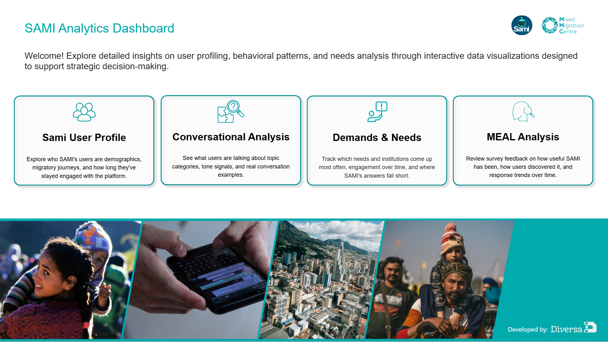
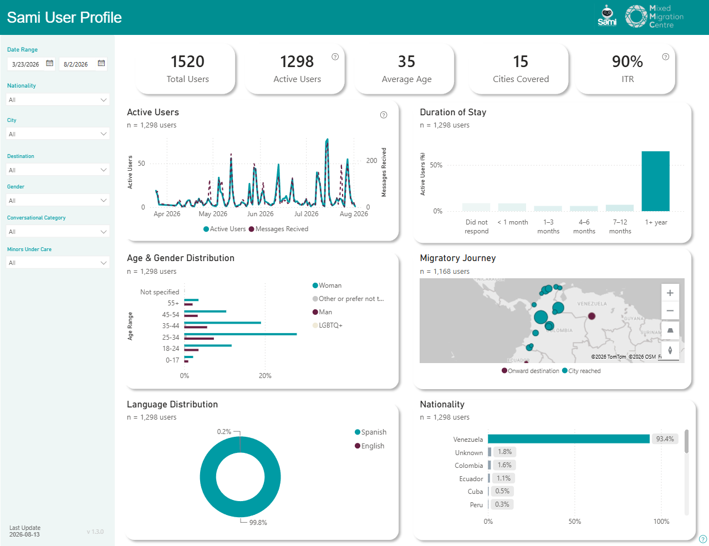
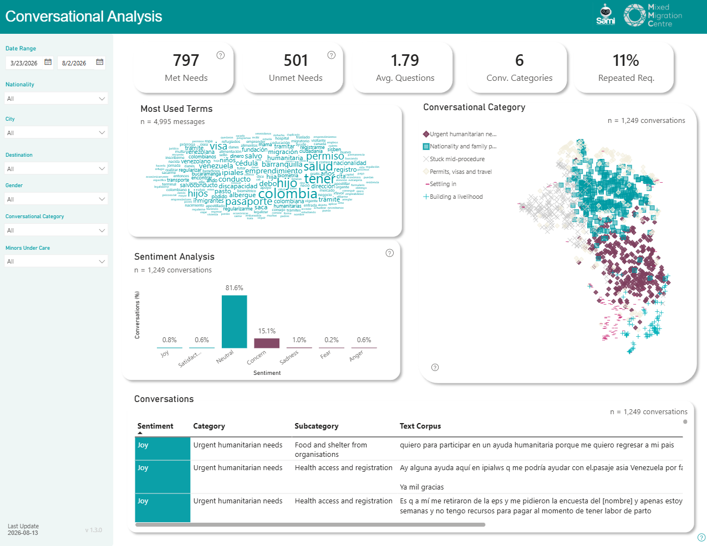
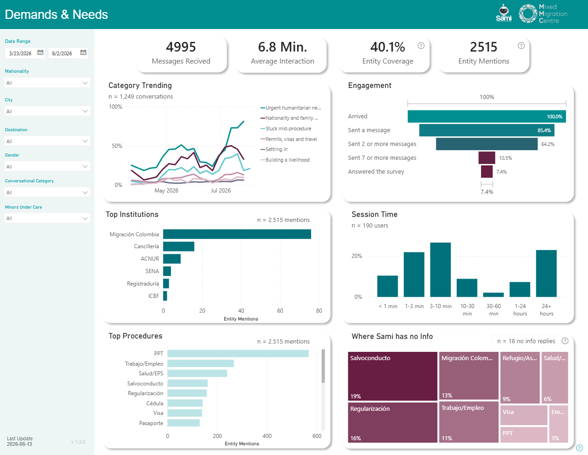
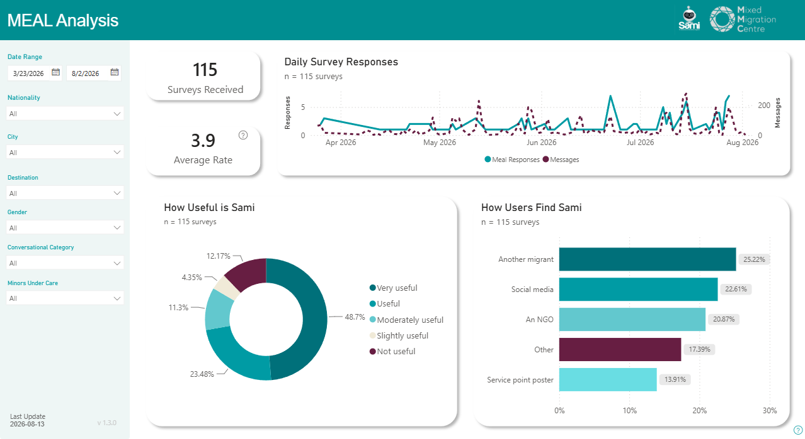

# Sami Chatbot Methodology for MMC

SAMI analytics and dashboard project for the MMC WhatsApp chatbot. The repo contains the Python pipeline, the analysis notebooks, the exported tables that feed Power BI, and the dashboard model itself.

#### Home



#### Sami User Profile



#### Conversational Analysis



#### Demands And Needs



#### MEAL Analysis



## Repository Layout

| Path | Purpose |
| --- | --- |
| [`datasets/`](datasets/README.md) | Input spreadsheets. Put the responses export in `datasets/responses/` and the MEAL export in `datasets/meal/`. |
| [`src/sami/`](src/sami/) | Core pipeline code: loading, cleaning, schema checks, metrics, clustering, NLP, QA, and export. |
| [`run_pipeline.py`](run_pipeline.py) | Rebuilds the `exports/` gold layer from the source spreadsheets. |
| [`notebooks/`](notebooks/) | The three analysis notebooks that present the story behind the data. |
| [`exports/`](exports/) | Generated CSV outputs used by the notebooks and the Power BI report. |
| [`powerbi/`](powerbi/) | The Power BI file and dashboard screenshots. |
| [`tests/`](tests/) | Automated checks for the pipeline and supporting modules. |
| [`validation/`](validation/) | Analyst labels used to validate tone and sentiment outputs. |

## What The Project Does

The pipeline reads the two source exports, validates them, builds tidy analytical tables, and writes the outputs into `exports/`. The notebooks explore the same data in three parts:

1. User profile and migration journey.
2. Demand, behaviour, and experience.
3. Text insights, themes, and sentiment.

The Power BI model reads the exported tables and presents the same story in an interactive dashboard.

## Quick Start

```powershell
uv sync
# add SAMI_SALT=<value> to a .env file at the repo root
uv run python run_pipeline.py --check
uv run python run_pipeline.py
```

If you only need the data inputs, see [`datasets/README.md`](datasets/README.md) for the expected folder layout and update process.

## Outputs

The main generated artifacts are the CSV tables in `exports/`, including the dimension, fact, aggregate, NLP, and quality-check tables. Those outputs are what the notebooks and the Power BI dashboard consume.

## Power BI Dashboard

[`powerbi/mmc_dashboard.pbix`](powerbi/mmc_dashboard.pbix) is the dashboard file. It contains three pages:

| Page | Focus |
| --- | --- |
| Sami User Profile | Audience composition, geography, and migration profile. |
| Demand & Experience | Message volume, engagement, institutions, procedures, and satisfaction. |
| Needs & Gaps | Unmet needs, priority themes, and discovered gaps. |

## Environment And Tests

The project targets Python 3.11+ and uses `uv` for dependency management.

```powershell
uv run python -m pytest
```
For anything not covered here: contact diana@diversa.studio
If you are working with the notebooks, start from the same environment created by `uv sync` so the local kernel matches the pipeline dependencies.
